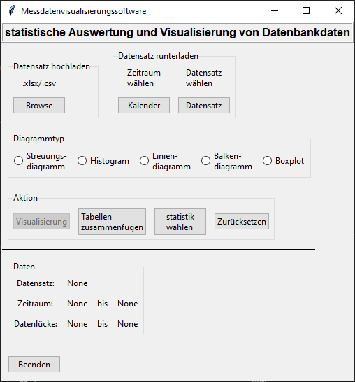
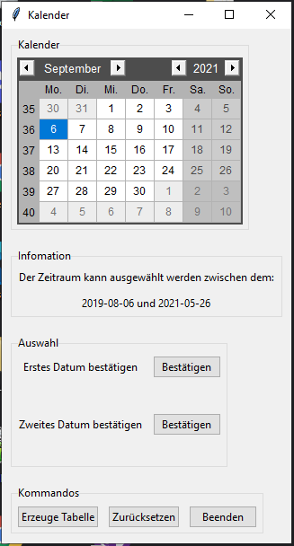
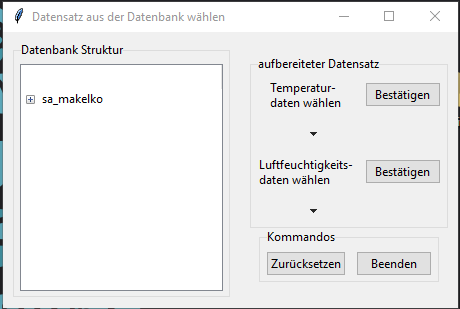
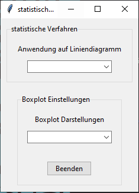

# Messdatenvisualisierungssoftware (Software für die statistische Auswertung von Datenbankdaten)

## Software-Fenster

   

## Anleitung

#### Auswahl eines Datensatzes
1. Luftfeuchtigkeit oder Temperaturdaten auswählen
2. mit der Taste "Bestätigen" Tase loggen sie den Datensatz

#### Auswahl eines Zeitraums
1. wählen Sie den Beginn und bestätigen sie das Datum mit der "Bestätigen"-Taste
2. wählen Sie das Ende des Zeitraums und bestätigen sie das Datum mit der "Bestätigen"-Taste
3. loggen Sie den Datensatz mit der Taste "Erzeuge Tabelle"

#### Die geloggten Tabellen müssen jetzt in dem Hauptmenü mit der Taste "Tabellen zusammenfügen" zusammengefügt werden.
#### Nun besteht die möglichkeiten den zusammengeführten Datensatz:
1. roh, mit den Visualisierungsmöglichkeiten im Hauptmenü, darzustellen.
2. ein statistisches Verfahren auf den Datnesatz anzuwenden und anhand eines Liniendiagramms darzustellen
2
